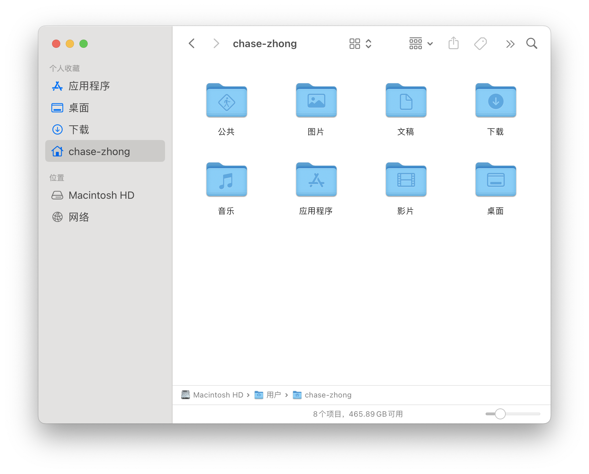
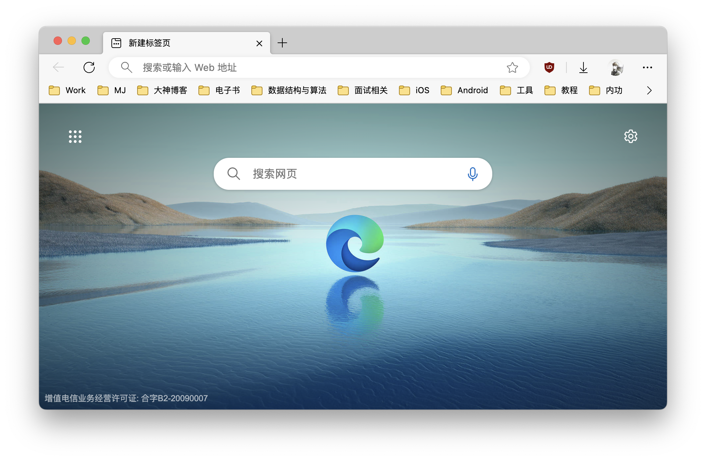
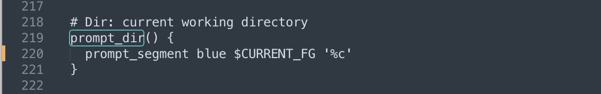
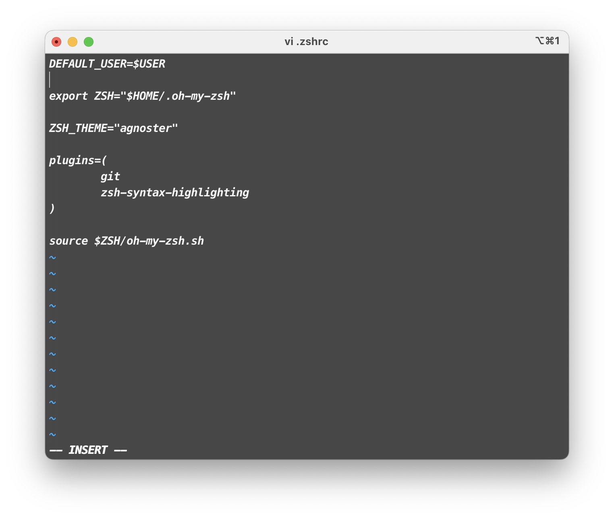

# Mac_Setup_List

### 关闭开机声音


### 关闭平滑字体

> Mac OS X 时代 设置里有一个选项叫做 「使用平滑字体」
>
> 这个选项**默认是打开的**，是为了在低分辨率屏幕上有更好的显示效果
>
> 缺点是字体会略微变粗，Retina 屏幕建议关掉这个选项
>
> 现在 Retina 屏幕已经普及，但是从 macOS 11 开始苹果在设置里去掉了这个选项
>
> 可以通过命令行来关闭平滑字体

```shell
defaults -currentHost write -g AppleFontSmoothing -int 0
```


### 关闭 SIP 以及 降低安全性

>  公司设备视情况酌情考虑


### Finder

- 开启新 Finder 窗口时打开 ~/
- 显示所有文件扩展名
- 不显示警告
- 执行搜索时：当前位置

- 移除不常用的边栏
- ~ 目录开启按名称排序
- 显示路径栏和状态栏



### 系统偏好设置

#### Apple ID

- 关闭 iCloud 云盘

#### 网络

- 关闭询问是否加入热点

#### 外观

- 边栏图标大小 -> 大
- 关闭基于墙纸调整窗口色调

#### 辅助功能

- 调整指针大小为1格

#### 控制中心

- Wi-Fi 和 声音 在菜单栏显示，其余所有关闭
- 始终显示日期
- 不显示星期

#### 关闭 Siri 搜索建议

#### 隐私与安全性

- 安全性：允许任何来源

  ```Shell
  sudo spctl --master-disable
  ```

- 始终允许配件连接

#### 桌面与 Dock

- 弃用将窗口最小化值引用程序图标
- 仅在台前调度中点按壁纸以显示桌面项目
- 不在 Dock 中显示最近使用的程序
- 设置触发角

#### 键盘

- 文字输入 -> 编辑 -> 在菜单栏显示输入法 -> 关闭
  - 自动纠正拼写关闭
  - 自动大写关闭
  - 连按两下空格关闭

#### 触控板

- 在页面之间轻扫 -> 关闭
- 关闭通知中心手势
- 关闭显示桌面
- 开启 Expose


### 浏览器

- 下载 Edge
- Edge 设置
  - 显示下载、扩展按钮
  - 关闭服务
  - 关闭不需要的UI
  - 设置搜索引擎



- 设置 Edge 为默认浏览器


- 下载搜狗输入法
  - 关闭花里胡哨功能
  - 选择一个皮肤
  - 勾选候选条动画
- 删除系统自带的 ABC 输入法
  - 下载 PlistEdit
  - 前往路径


### 安装 Mos

> macOS 的鼠标滚轮支持欠优化，需要安装鼠标平滑软件

- 开机启动
- 隐藏状态栏图标
- 虚拟机添加白名单


### 安装 iStat Menus

- Optional:[ZhongWentao2002/My_Configs: 个人的一些配置文件 (github.com)](https://github.com/ZhongWentao2002/My_Configs)


### 安装 iTerm

- 设置 iTerm 为默认的应用
  - sh 与 可执行程序

### 配置命令行 与Oh My Zsh

- 安装 Xcode

- 安装 Command Line Tools

- 安装 Python (装 x86 版，保证兼容性)

- 安装 Homebrew

  ```Shell
   (echo; echo 'eval "$(/opt/homebrew/bin/brew shellenv)"') >> /Users/chase-zhong/.zprofile
      eval "$(/opt/homebrew/bin/brew shellenv)"
  ```

- 安装 Oh My Zsh

  ```Shell
  sh -c "$(curl -fsSL https://raw.githubusercontent.com/robbyrussell/oh-my-zsh/master/tools/install.sh)"
  ```

- 安装 PowerLine

  ```Shell
  pip3 install powerline-status --user
  ```

- 安装 PowerFonts

  ```Shell
  git clone https://github.com/powerline/fonts.git --depth=1
  
  cd fonts
  
  ./install.sh
  ```

- 安装 Agnoster 主题

  ```Shell
  git clone https://github.com/fcamblor/oh-my-zsh-agnoster-fcamblor.git
  
  cd oh-my-zsh-agnoster-fcamblor/
  
  ./install
  ```

- 导入配置文件 (Optional)

  [ZhongWentao2002/My_Configs: 个人的一些配置文件 (github.com)](https://github.com/ZhongWentao2002/My_Configs)

- 隐藏主机名

  ```Shell
  # .zshrc
  
  DEFAULT_USER=$USER
  ```

- 缩短文件夹路径

  ```Shell
  ~/.oh-my-zsh/themes/agnoster.zsh-theme
  ```
  
  

- 安装高亮插件

  ```Shell
  cd ~/.oh-my-zsh/custom/plugins/
  
  git clone https://github.com/zsh-users/zsh-syntax-highlighting.git
  
  vi ~/.zshrc
  ```

  

